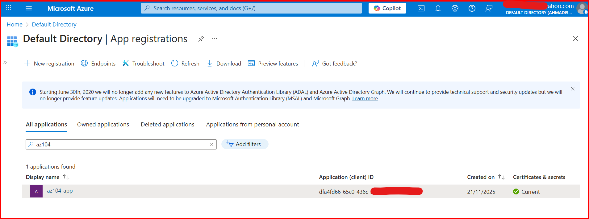
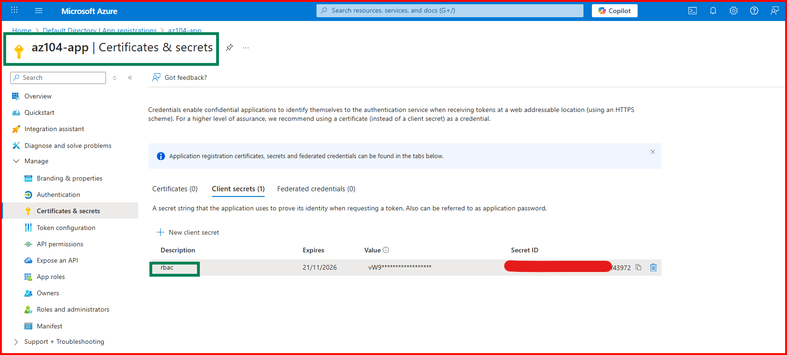

# App Registration & SPN

## Objective
Create App Registration & Service Principal.

## Steps
1. Go to App Registrations → New registration.
2. Create Client Secret.
3. Create SPN:
```
az ad sp create-for-rbac --name "az104-app"
```

> **Command Breakdown:**
> *   `az ad sp`: Interact with Azure Active Directory Service Principals.
> *   `create-for-rbac`: Automates creating an App Registration, a Service Principal, and assigning a role (default: Contributor) in one step.
> *   `--name`: Sets a friendly name for the application.
>
> **Output:** This command generates a JSON output containing the `appId` (username), `password` (client secret), and `tenant`. **Save this output immediately** as the password cannot be retrieved later.

```json
{
  "appId": "00000000-0000-0000-0000-000000000000",
  "displayName": "az104-app",
  "password": "xxxxxxxx-xxxx-xxxx-xxxx-xxxxxxxxxxxx",
  "tenant": "00000000-0000-0000-0000-000000000000"
}
```
**Output Response of New SPN name - az104-app**




4. Test login:
```
az login --service-principal --username <client-id> --password <secret> --tenant <tenant-id>
```

> **Verification Output:**
> If successful, you will see a JSON response listing the subscriptions the SPN has access to.

```json
[
  {
    "cloudName": "AzureCloud",
    "homeTenantId": "00000000-0000-0000-0000-000000000000",
    "id": "00000000-0000-0000-0000-000000000000",
    "isDefault": true,
    "managedByTenants": [],
    "name": "IMR_PROD",
    "state": "Enabled",
    "tenantId": "00000000-0000-0000-0000-000000000000",
    "user": {
      "name": "00000000-0000-0000-0000-000000000000",
      "type": "servicePrincipal"
    }
  }
]
```